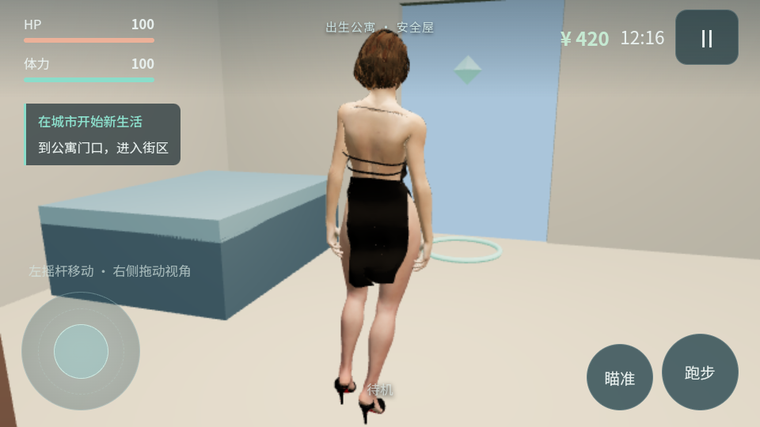

# 城市比例、鞋裙与女性市民更新

本次基于 `003112fb50b209466b48aa1d24e726cf78587b5b`，将现有地图放大 60%，修正 Ada 黑鞋，加入上传的侧空高跟鞋、连衣裙和六名女性市民。主角模型、默认外观及原四段动画继续保留。按用户追加要求，本次提交启动 GitHub Actions，构建版本码 4、版本名 `0.4.0-city-clothes` 的离线测试 APK。

## 游戏变化

- 现有城市缩放 `0.45 → 0.72`，原街区范围变为 `401.76 × 168.48m`，路缘高约 `0.144m`。Jill 保持原始尺寸约 `1.7303m`，人物根节点缩放始终为 `[1,1,1]`。
- 地标、任务点、出生门、男性和女性市民锚点统一随城市放大；建筑碰撞从同一比例计算，镜头也使用相同障碍数据。旧城市存档位置迁移至新比例，公寓位置、金钱、完成任务和穿着不被重置。
- 新上传的 `city.glb` 与已有 CCity 不同，作为东侧街区接入，中心在世界坐标 `x=245m`，保留旧任务城市。该街区以米制几何再放大 `1.6` 倍，建筑和停放车使用七个连贯障碍框，街道与主地图通过地面连接。连接区域目前是简单平面，尚未美化道路尽头。
- Ada 黑鞋沿用原鞋面和鞋跟，收紧封闭鞋内的脚面，并使用连续皮肤顶点修正，取消鞋口附近删三角形导致的断边。脱鞋恢复原身体顶点，不修改 Jill 的原始 GLB。
- 上传 D’Orsay 鞋制作左右镜像的一双，保留侧空结构、黑鞋面和红色鞋底，适配脚踝/脚掌骨骼。物品 `dorsay-shoes` 使用 `shoes` 槽，可与 Ada 上衣、连衣裙独立搭配。
- 上传连衣裙只提取 `FABRIC_1_FRONT_1309` 网格，排除源文件的人体、头发和鞋；适配躯干与下肢权重，吊带跟随胸背骨骼。物品 `city-dress` 使用 `dress` 槽。
- 衣柜增加「Ada 上衣 · D’Orsay 高跟鞋」「黑色连衣裙 · 赤脚」「黑色连衣裙 · D’Orsay 高跟鞋」，合计十个预设。四件真实测试服装在新旧存档中免费可选，商店仍保留商品数据和价格。鞋子切换不会卸下裙子，裙子与上衣/下装沿用互斥规则。
- 女性集合拆分为 `female-citizen-01…06.glb`，各自保留 57 个骨骼、原材质和贴图，身高 `1.694～1.707m`。修正源集合网格与骨架横向偏移不同的问题，防止手臂/躯干被拉长。
- 女性 `Citizen_Idle` 使用上传 `Standing Idle(1).fbx`，`Citizen_Walk` 使用上传 `Dwarf Walk(1).fbx`，`Citizen_Talk` 重定向现有男性市民同一段对话动作。动画均以 30fps 烘焙、循环、原地播放并校正脚底高度，步幅驱动行走相位。
- NPC 总数限制为 12 名，男女各六名；店员阿晴为女性，其他任务目标 ID 保留。东街布置两名女性市民。继续使用 `Idle / WalkTo / Talk`、障碍约束 waypoint 路径和 `40/80m` 距离更新档位。

镜头沿用更新前默认 `2.2m` 和瞄准 `1.85m`，本次未改动镜头距离。预览脚本的观察镜头只用于截图。

## 资源与性能

| 成品 | 网格/三角形 | 大小 |
| --- | --- | --- |
| D’Orsay 双鞋 | 2 / 26,844 | 1,802,552 B |
| 连衣裙 | 1 / 2,970 | 665,360 B |
| 新城东街 | 96 / 90,681 | 11,435,124 B |
| 新城无损 gzip | 构建前恢复并校验 | 9,114,014 B |
| 六名女性市民 | 每人约 5 千三角形 | 单体约 2.7～5.1 MB |

新城按材质合并、去除重复顶点并简化大网格；保留材质边界和贴图，纹理上限 512。相较源网格 173,660 三角形减少约 48%。新街区距主角超过 150m 时隐藏，不参与动态投影。女性纹理上限 1024；实例复用几何、材质和纹理，骨架独立。主要资源纹理全部嵌入 GLB，运行时无外部下载。

## 检查与预览

检查原始 JSON 记录位于 [`validation/city-clothes/`](validation/city-clothes/)。

- 城市缩放、人物地面高度、原城和东街建筑/相机碰撞、连接路径与全部 NPC 出生点检查通过。
- 实际 Avatar 蒙皮检查 480 个服装动画姿势，鞋底最低采样约 `0.77mm` 高于地面；根节点尺寸正确，脱衣恢复原身体。
- 六名女性的三段动画检查 1,170 个姿势，最低脚底约 `-1.17mm`，采样最高点约 `1.731m`，未发现 NaN、异常拉长或骨架偏移。
- 既有城市、生活系统、Ada 服装检查与新增资源 SHA-256、模块引用、内嵌贴图检查通过。
- 浏览器实际触摸 UI 检查三项任务、奖励、购买、独立部位换装、瞄准、多指摇杆+跑步、NPC 导航、东街女性对话、存档重开、三种横屏分辨率与本地资源请求。结果见 `browser.json`。
- 五张交付图由实际 Three.js 模型/运行游戏渲染：城市新比例与东街、修正黑鞋、新侧空鞋、连衣裙搭配、六名女性的待机/走路/对话。不使用生成图片代替模型效果。

Android 仪器检查同步更新城市坐标、12 名 NPC 及鞋裙恢复断言。Android 35、WebView 124、断网环境的完整测试已返回 `OK (1 test)`；详见下方记录。浏览器软件 GPU 和模拟器检查不能代表手机真机帧率。

## Android 测试 APK

| 项目 | 结果 |
| --- | --- |
| 模型/游戏代码 | [dada387](https://github.com/752960522qq-ai/luna_15/commit/dada387385422fe04cd7248329e9d10a3c92fe9f) |
| 已测试的构建提交 | [b6ce818](https://github.com/752960522qq-ai/luna_15/commit/b6ce818644a0295f6d22ad772719b5c4191fdc0f)；仅调整 CI，与首次交付 APK 逐字节相同 |
| 构建与测试 | [Actions 37245427463](https://github.com/752960522qq-ai/luna_15/actions/runs/37245427463) / 整体 `success`；附件 `luna15-life-v1-test`、`luna15-emulator-results` |
| 包名 / 版本 | `com.luna.heelmotion` / `4` / `0.4.0-city-clothes` |
| 大小 | `154,986,461 B`（147.81 MiB） |
| APK SHA-256 | `0e43cab26858a487dfc5f4cc0ba1d71158d602d85ca92abd44684a64fe8a5a03` |
| 签名 | v2 校验通过；沿用原测试签名，可覆盖原测试版 |
| 证书 SHA-256 | `7528de7eb9532f22bea263083133f93ee38c75687d880705d147f0a90e0203b8` |
| 构建检查 | 应用与 instrumentation APK、`lintDebug`、版本、离线资源、CRC 与源文件一致性全部通过 |
| Android 测试 | API 35 / WebView 124 / ANGLE + SwiftShader，关闭 Wi-Fi/移动数据；`OK (1 test)`，320.846 秒；模拟器任务 `success` |
| 兼容要求 | Android 8.0+；系统 WebView 支持 WebGL 2；架构通用 |

实际 Android 测试走通主菜单、公寓、城市、NPC、任务、商店、奖励和保存；检查原生双指摇杆+跑步、瞄准权重、放大后的城市地面接触、12 名 NPC、裙子与新鞋的网格数量，以及新 WebView 恢复金钱 420、已完成任务和鞋裙装束。原始输出保存在 [instrumentation.txt](validation/city-clothes/android-emulator/instrumentation.txt)，构建 JSON 位于 `validation/city-clothes/android-build/`，完整运行记录见 [android.json](validation/city-clothes/android.json)。

完整复测于 UTC `2026-10-05 00:02:53` 返回 `OK (1 test)`，随后 SDK 正常关闭模拟器、上传诊断附件，工作流于 `00:02:58` 以 `success` 结束。应用退出信息为 instrumentation 完成后的正常 force-stop，未记录应用崩溃或 ANR。原始退出日志见 [teardown.txt](validation/city-clothes/android-emulator/teardown.txt)，实际 Android 截图见下方。

此前 [Actions 37222947608](https://github.com/752960522qq-ai/luna_15/actions/runs/37222947608) 的游戏测试通过后，QEMU 及辅助进程未退出，导致工作流超时取消。现已加入仅限 CI 测试模拟器的 15 秒宿主进程清理兜底和诊断输出，并完成补丁启用后的整条复测。本轮 SDK 正常退出，兜底未触发；未单独模拟强制清理分支。三次较早的中断/超时记录继续保留在 `android.json`。

交付名为 `luna15-city-clothes-test.apk`，仅重命名，内容与 Actions 的 `luna15-life-v1-test.apk` 相同。应用代码和 APK 均不因最后的报告/CI 清理提交发生变化。

## 主要文件

| 类型 | 文件 |
| --- | --- |
| 新增资源 | `web/assets/dorsay-shoes.glb`、`city-dress.glb`、`npcs/female-citizen-01…06.glb`、`npcs/female-manifest.json` |
| 新增归档和校验 | `models/city-east-district.glb.gz`、`city-district-manifest.json`、`new-wardrobe-manifest.json` |
| 新增配置 | `web/world-config.js` |
| 新增制作脚本 | `scripts/asset_tools.py`、`prepare_city_district.py`、`prepare_new_wardrobe.py`、`prepare_female_citizens.py`、`source/female-citizen-{walk,idle}.json` |
| 新增检查/预览 | `scripts/check_city_clothes.mjs`、`render_city_clothes.mjs`、`render_world_update.mjs` |
| 修改游戏 | `web/app.js`、`city.js`、`life-data.js`、`player-state.js`、`game-systems.js`、`npcs.js`、`wardrobe-attachments.js` |
| 修改已有资源 | `web/assets/ada-shoes.glb`、`models/ada-clothing-manifest.json` |
| 修改检查/恢复 | `scripts/run_android_smoke.sh`（新增）、`scripts/prepare_assets.py`、`check_web.py`、`check_city.mjs`、`check_life.mjs`、`check_life_browser.mjs`、Android `MovementSmokeTest.java`、`.github/workflows/android-test.yml`、`android/app/build.gradle` |
| 文档 | `README.md`、本报告、`docs/validation/city-clothes/*.json` |

生成脚本需要 Python 的 numpy/scipy/Pillow/fast-simplification；从原始素材重新制作时传入对应原上传 GLB，动画采样数据已保存在仓库。正常运行或打包使用已适配成品，无需这些 Python 建模依赖。

## 已知限制

- 连衣裙采用骨骼蒙皮，没有布料物理；大步、快速转向和极端动作的裙摆、吊带仍可能出现局部拉伸或贴合瑕疵。短裙和开放鞋口不能保证所有未提供动作都零穿模。
- 鞋口的源低多边形轮廓和身体细节在极近镜头下仍可见；本次修正的是明显脚面穿出和断边，未重建高精度身体/服装拓扑。
- 新城碰撞采用连贯建筑包围盒，不包含复杂室内、楼梯、独立小道具物理。街区连接为平坦测试区，后续可补充路面和路口。
- 女市民保留用户提供的模型造型；分类由 `gender` 元数据决定。仍无角色间物理推挤，也没有车流或完整 NavMesh。
- 新增模型和贴图增加加载时间/显存占用。距离更新和街区隐藏已接入，但本次没有 Android 帧率实测。

## 回滚

GitHub 已保留 `rollback/pre-city-clothes-female-20261004`，指向更新前 `003112fb50b209466b48aa1d24e726cf78587b5b`；恢复此分支即可回到原城市与 Ada 服装版本。本次不改变 Android 包名或签名。

## 素材署名

以下信息来自用户上传 GLB 的内嵌 `asset.extras`，成品和清单继续保留署名；适配包括拆分、尺寸调整、简化、骨骼重定向和绑定。

| 素材 | 作者 | 许可 / 来源 |
| --- | --- | --- |
| City | abhayexe | [CC BY 4.0](https://creativecommons.org/licenses/by/4.0/) / [原作](https://sketchfab.com/3d-models/city-14941a37dcbf4efd9c1f1d713aa157de) |
| D’Orsay High Heels | hiirusama | [CC BY 4.0](https://creativecommons.org/licenses/by/4.0/) / [原作](https://sketchfab.com/3d-models/dorsay-high-heels-91b7063acfad41aa8f34a8b7abf5cce1) |
| Dress | samsikua | [CC BY 4.0](https://creativecommons.org/licenses/by/4.0/) / [原作](https://sketchfab.com/3d-models/dress-e110815707f54793ae91f89d2c5bb06a) |
| Female citizen dafuq | That one larry / Professor_E12 | [CC BY 4.0](https://creativecommons.org/licenses/by/4.0/) / [原作](https://sketchfab.com/3d-models/female-citizen-dafuq-0015793aa3af4b4f91440cc6155483d2) |

女性动画使用用户上传的两份 FBX，对话沿用仓库已有 `Talking.fbx` 的烘焙动作；既有 Jill、Ada、男性市民和 CCity 的许可信息见先前报告及原资源。
